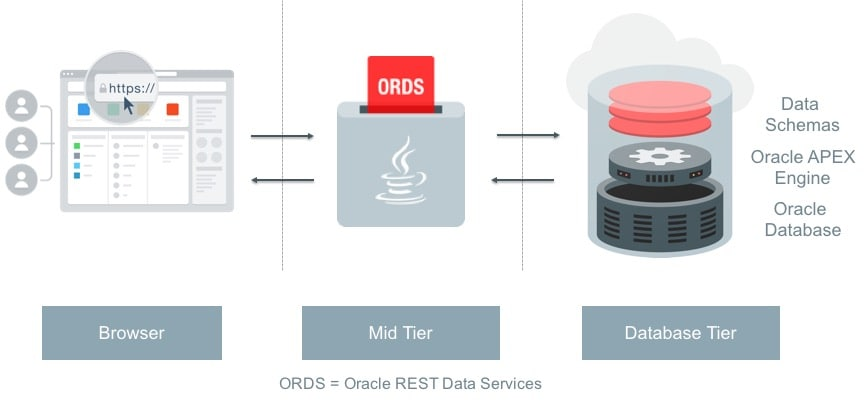
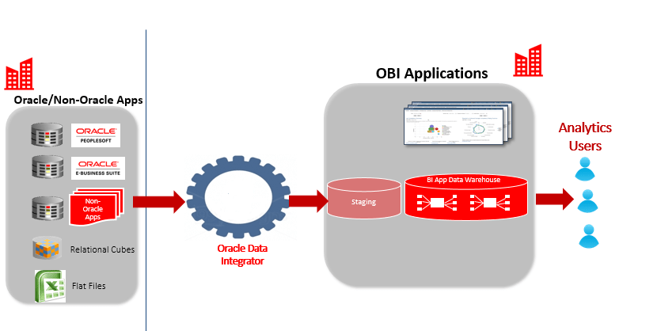
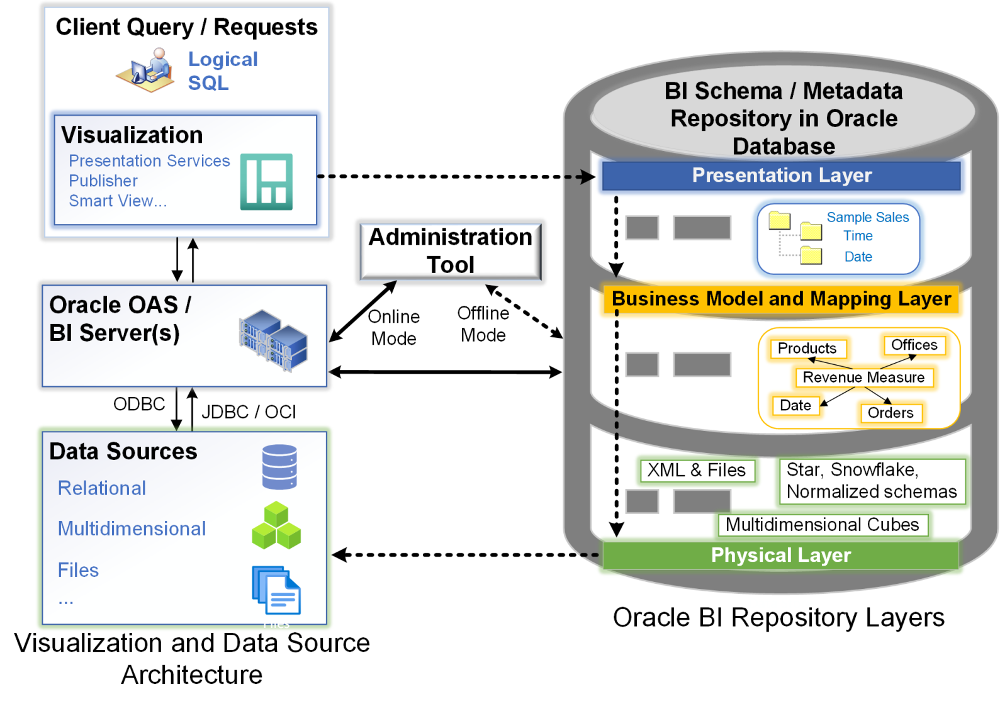

# Service Integration: Supercharging Oracle Database

Oracle Database isn’t just a database—it’s a powerhouse that works hand-in-hand with a suite of tools to make your life easier. Whether you’re building apps, moving data, or analyzing trends, these tools have got you covered. Let’s break it down:

## **1. Oracle Application Express (APEX): Build Apps Fast**

Think of APEX as your shortcut to building web apps without drowning in code. It’s perfect for creating tools, dashboards, or even customer-facing apps—all on top of Oracle Database.

### **Strong points:**

- **No Coding Wizardry Needed:** Drag, drop, and done. Seriously, it’s that easy.
- **Built-in Security:** Keeps your apps safe without extra hassle.
- **Grows with You:** Handles small teams or massive enterprises without breaking a sweat.
- **Quick Prototyping:** Go from idea to working app in no time.

### **Use Case:**

- Internal tools like data entry forms or reports.
- Customer portals for e-commerce or service management.

## **2. Oracle Data Integrator (ODI): Easy data integrator**

ODI is your go-to tool for moving data around—whether it’s from old systems, spreadsheets, or other databases. It’s like a data-moving ninja that keeps everything in sync.

### **Strong points:**

- **Works with Anything:** Databases, files,etc...
- **No Heavy Coding:** Set up the rules, crons,etc... ODI does the heavy lifting.
- **Real-Time Sync:** Keeps your data fresh and up-to-date.
- **Keeps Data Clean:** Built-in checks ensure your data is accurate.

### **Use Case:**

- Migrating data from legacy systems to Oracle.
- Combining data from multiple sources for analytics.

## **3. Oracle Analytics Server (OAS): Turn Data into Insights**

### **Strong Points:**

- **Beautiful Visuals:** Create dashboards and charts that actually make sense.
- **Self-Service:** Let your team explore data without waiting for IT.
- **Works Everywhere:** Analyze data from Oracle, cloud, or other sources.

### **Ideal For:**

- Business intelligence and reporting.
- Predictive analytics for sales, marketing, or operations.
- Overall easy dashbaord setup

## **Why These Tools Matter**

They take Oracle Database from a simple data store to a full-fledged platform for building, integrating, and analyzing. Whether you’re a developer, analyst, or business user, they’ll save you time and unlock new possibilities.
