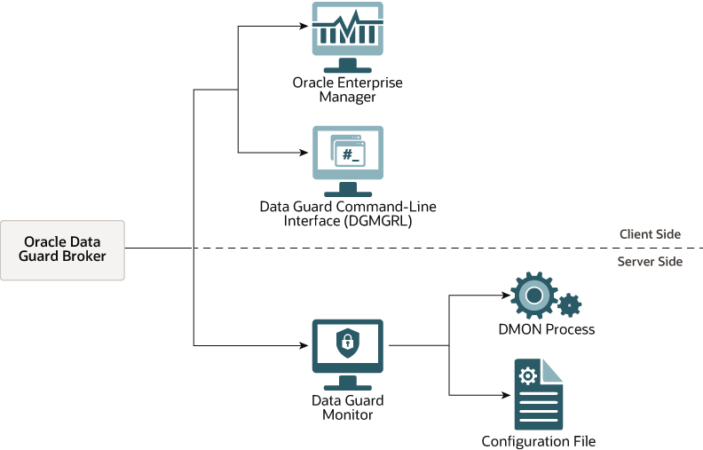

# Advanced Services in Oracle Database

Oracle Database offers a suite of advanced services designed to ensure **data integrity**, **high availability**, and **disaster recovery**. These tools are critical for enterprise environments where downtime or data loss is not an option. Below is a detailed overview of these services:

## **1. Flashback Technology**

Flashback Technology provides a powerful mechanism to recover data from a previous point in time, enabling you to undo errors or analyze historical data without restoring from backups.


### **Key Components:**

- **Flashback Query:**  
   Allows querying data as it existed at a specific point in time. Useful for recovering accidentally deleted or modified data.
  ```sql
  SELECT * FROM employees AS OF TIMESTAMP TO_TIMESTAMP('2023-10-01 12:00:00', 'YYYY-MM-DD HH24:MI:SS');
  ```
- **Flashback Table:**  
   Restores a table to a previous state, undoing changes made after a specific point in time.
  ```sql
  FLASHBACK TABLE employees TO TIMESTAMP TO_TIMESTAMP('2023-10-01 12:00:00', 'YYYY-MM-DD HH24:MI:SS');
  ```
- **Flashback Database:**  
   Rolls back the entire database to a previous point in time, useful for catastrophic errors or logical corruption.
  ```sql
  FLASHBACK DATABASE TO TIMESTAMP TO_TIMESTAMP('2023-10-01 12:00:00', 'YYYY-MM-DD HH24:MI:SS');
  ```

### **Use Cases:**

- Recovering from accidental data deletions or updates.
- Auditing historical data changes.
- Testing scenarios by reverting to a previous state.

## **2. Oracle Recovery Manager (RMAN)**

RMAN is Oracle’s robust backup and recovery tool, designed to simplify and automate the process of protecting your database.


### **Key Features:**

- **Incremental Backups:**  
   Backs up only the data that has changed since the last backup, reducing time and storage requirements.
  ```bash
  RMAN> BACKUP INCREMENTAL LEVEL 1 DATABASE;
  ```
- **Compressed Backups:**  
   Reduces the size of backup files, saving storage space.
  ```bash
  RMAN> BACKUP AS COMPRESSED BACKUPSET DATABASE;
  ```
- **Automated Recovery:**  
   Streamlines the recovery process with minimal manual intervention.
  ```bash
  RMAN> RECOVER DATABASE;
  ```
- **Backup Validation:**  
   Verifies the integrity of backup files without restoring them.
  ```bash
  RMAN> VALIDATE BACKUPSET;
  ```

### **Use Cases:**

- Regular database backups for disaster recovery.
- Point-in-time recovery for logical errors.
- Migrating databases across environments.

## **3. Oracle Data Guard**

Oracle Data Guard ensures **high availability** and **disaster recovery** by maintaining a synchronized standby database. It provides real-time data replication and automatic failover capabilities.


### **Key Features:**

- **Real-Time Data Replication:**  
   Continuously synchronizes the primary and standby databases, ensuring minimal data loss.
- **Automatic Failover:**  
   Automatically promotes the standby database to primary in case of a failure, minimizing downtime.
- **Role Transitions:**  
   Allows seamless switching between primary and standby roles for maintenance or testing.
- **Data Protection Modes:**  
   Offers multiple modes (Maximum Performance, Maximum Availability, Maximum Protection) to balance performance and data safety.

### **Use Cases:**

- Disaster recovery for mission-critical systems.
- Zero-downtime maintenance and upgrades.
- Load balancing by offloading read-only queries to the standby database.

## **Why These Services Matter**

These advanced services are essential for maintaining **data integrity**, **availability**, and **recoverability** in enterprise environments. They provide the tools needed to:

- Recover from human errors or logical corruption (Flashback).
- Protect against data loss with efficient backups (RMAN).
- Ensure business continuity with high availability (Data Guard).
